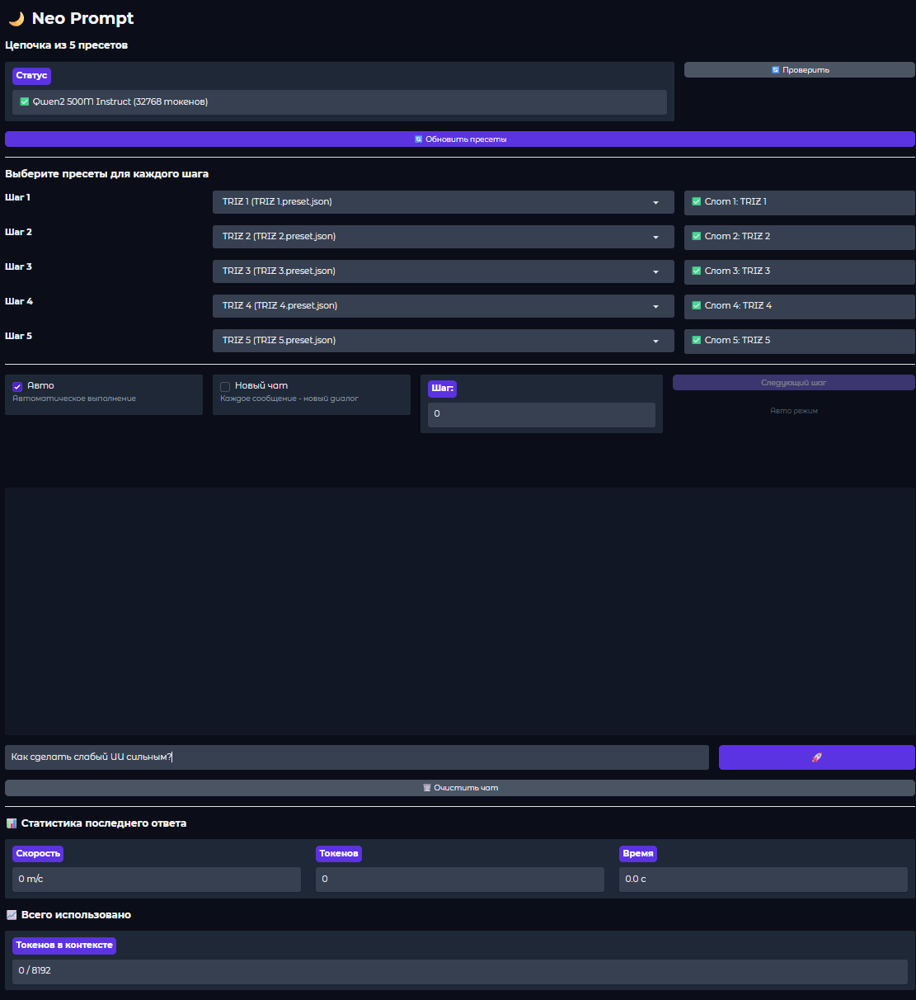

# Neo Prompt
Neo Prompt — это веб-интерфейс на базе Gradio для работы с локальным сервером LM Studio. Он позволяет выстраивать цепочки из до 5 пресетов (промптов) и обрабатывать запросы последовательно, с полной поддержкой стриминга, отображением «размышлений» модели (reasoning) и детальной статистикой использования токенов.



# ✨ Возможности
## 🔌 Подключение к LM Studio API
Автоматическое определение статуса сервера и загруженной модели.

## 🔗 Цепочка из 5 пресетов
Выберите до пяти пресетов из конфигурационных файлов LM Studio. Запрос будет обработан каждым пресетом по очереди.

## ⚡ Стриминг ответов
Ответы генерируются в реальном времени. Отдельный блок показывает процесс «мышления» модели (reasoning content).

## 🤖 Автоматический или ручной режим
В авто-режиме все шаги выполняются последовательно. В ручном — вы контролируете переход к следующему шагу кнопкой.

## 🆕 Режим «Новый чат»
Каждое сообщение может начинаться с чистым контекстом, если это необходимо.

## 📊 Детальная статистика
Скорость генерации, количество токенов в последнем ответе, время выполнения и общий прогресс использования контекстного окна.

## 🎨 Современный интерфейс
Приятная тёмная тема, адаптированная для Gradio.

## 📋 Требования
Установленный и запущенный LM Studio с активным локальным API‑сервером.

Одна или несколько загруженных моделей (приоритет можно настроить в config.py).

Python 3.12 или выше.

# 🚀 Быстрый старт
Клонируйте репозиторий:

```bash
git clone https://github.com/AITISPEC/neo-prompt.git
cd neo-prompt
```
Установите зависимости:

```bash
pip install -r requirements.txt
```
Настройте конфигурацию (при необходимости):
Отредактируйте config.py, указав актуальный адрес сервера LM Studio и список приоритетных моделей.

```python
BASE_API_URL = "http://192.168.0.98:1234"
MODEL_PRIORITY = [
    {"key": "qwen/qwen3-vl-4b", "name": "QWEN"},
    # ...
]
```

Запустите приложение:

```bash
python Neo-Prompt.py
```
Откройте браузер и перейдите по адресу http://127.0.0.1:7860.

# 🧩 Структура проекта
Файл	Назначение
Neo-Prompt.py   	Главный файл приложения с интерфейсом Gradio.
config.py	        Настройки: адрес API, приоритет моделей, размер контекста.
neo_client.py	    Клиент для взаимодействия с LM Studio API, стриминг, статистика.
model_manager.py	Управление цепочкой пресетов, состоянием шагов, режимами.
presets.py         	Загрузка пресетов из файловой системы LM Studio.
formatters.py   	Форматирование отображения reasoning и ответов.
ui_components.py	CSS-стили для красивого отображения в Gradio.
requirements.txt	Список Python‑зависимостей.

# 🖥️ Использование
Проверьте статус сервера — нажмите кнопку «Проверить». Если всё в порядке, вы увидите название модели и доступный контекст.

Обновите список пресетов — кнопка «Обновить пресеты» загрузит все пресеты из папки ~/.lmstudio/config-presets/.

Выберите пресеты для шагов (от 1 до 5). Можно оставить пустые слоты — тогда цепочка будет короче.

Настройте режимы:

Авто — все выбранные шаги выполняются автоматически подряд.

Новый чат — каждый запрос отправляется без предыдущего контекста (полезно при тестировании).

Введите сообщение и нажмите «Отправить».

Во время генерации в верхней области отображается процесс «размышления» модели. После завершения ответ появляется в чате.

Справа отображается статистика по последнему ответу и общее использование токенов.

# 🔧 Дополнительная настройка
Смена темы интерфейса: измените параметр theme в demo.launch().

Порт и доступ: по умолчанию server_name="127.0.0.1", server_port=7860. Для доступа из локальной сети измените server_name на "0.0.0.0".

## 📄 Лицензия
Проект распространяется под лицензией Apache 2.0. Подробности см. в файле LICENSE.

## 🤝 Вклад
Приветствуются сообщения об ошибках, предложения по улучшению и пул-реквесты. Для серьёзных изменений сначала создайте issue для обсуждения.

# Neo Prompt — сделайте работу с LM Studio удобной и продуктивной! 🚀
